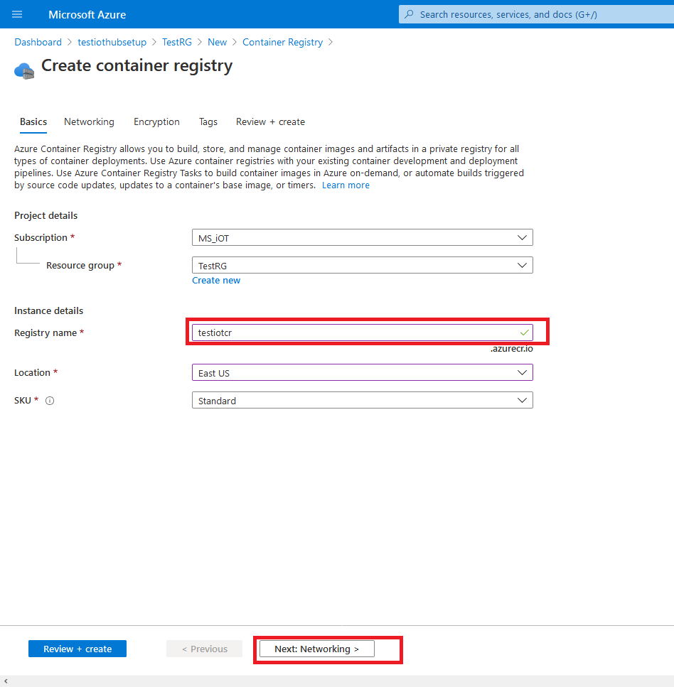
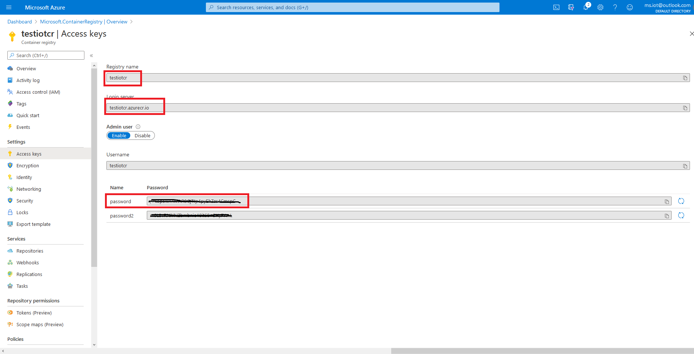
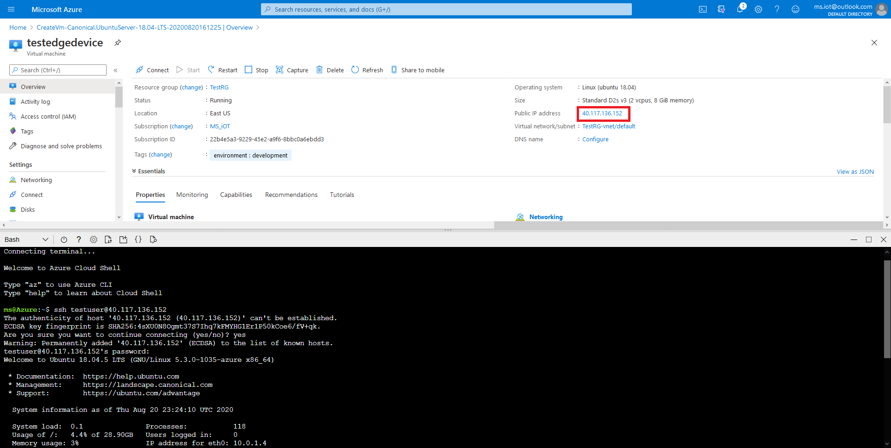

id: IoT Edge Setup
summary: This codelab is a template for coming up with a "hello world" IoT edge setup on a new hardware/environment
authors: Amar M. Balutkar <amar.balutkar@quest-global.com>
feedback: amar.balutkar@quest-global.com

# Azure IoT Edge codelab by QuEST Global
<!-- ------------------------ -->
<!-- ------------------------ -->
## Objective
The objective of this hands on lab is to bringup an Azure IoT Edge solution on a new Azure account. We will use a combination of Azure portal, commandline & Visual Studio Code.

By the end of this lab you would have:
- The necessary Azure resources configured on your Azure account

- An edge device (either a VM or a real device) running IoT Edge

- A visual studio solution from where you can write, compile/build & deploy IoT edge modules which can run on the edge device that you have configured

These tasks are summarized as below:


### What you need? (Pre-requisites)

- Ensure you have subscription to Azure and are able to access resources via portal.azure.com
- Familiarity with commandline: In this lab for some operations, you can either use <code>az cli</code> extension with your favourite shell terminal or use <code>shell.azure.com</code>
- Ensure you have visual studio code (required for section 6). Download from here if you dont have it already: [Link to download VS Code](https://code.visualstudio.com/download)
- You will also require Docker desktop to be running on your local machine (PC, Laptop). This is required for building IoT edge modules. You can download docker desktop from here: [Link to download docker desktop](https://www.docker.com/products/docker-desktop)

## Preparing the Infra 
Duration: 10

### Initial setup: Resource group creation (typical one time for a given project)

As a good practice, we want to create a new resource group. A resource group allows to group different Azure resources together belonging to the same solution or deployment.

- Once you login to Azure portal, search for Resource groups. Click on the "Create" button to create a new resource group.


- Next, select the subscription, provide the name (something that is logical for you to  for resource group & select a region (the Azure datacentre where the resource group would be located).


- Next, you can provide a "tag" information, which is a key value pair. A tag can carry metadata information, like type of environment:dev/QA/production etc.


- Once you have filled up correctly, the validation should pass and you are ready with your resource group!

Now that our resource group is created, we will create other Azure resources to be part of this resource group.

### Initial setup: IoT Hub creation (typical one time for a given project)

- Go to the resource group that we just created & click add


- Next, search for IoT Hub, provide it a name and follow along the steps till the "tags" page. We will use the same tag that we provided earlier to be consistent with our naming. (We will keep the default options for now, but later you can change them as per the requirements)


- Now our IoT Hub resource is created. Next, we will create an Azure IoT Edge device. Note: We are just creating a cloud resource and not yet connecting it to an actual device, we will do in in the later section. For now, lets just create an instance with a suitable name for the edge device.


- Optional Step: We want to create an Azure container registry instance if you plan to develop & deploy our own IoT Edge modules.






Negative
: Make sure you save the ACR URL, registry name and the Password (all highlighted in Red). We will use these values to configure Azure IoT Edge modules for custom module development.

- So we have completed our first step towards our goal.In the next section we will move towards getting our edge device ready.


<!-- ------------------------ -->
## Preparing the Edge Device
Duration: 10

In this exercise, we will create a new VM instance and use it for our development. You can replace the VM with an actual physical device (eg: raspberry PI), which will require the dependencies & Azure IoT Edge package to be installed as per its OS & architecture.

- First, select the Ubuntu Server 18.04 LTS from the add resource page


- Next, provide the VM a name. We will also need to provide a username & password which will allow us to SSH remotely into the VM


- We will have to provide a storage account name to keep diagnostic logs & provide the tag name (best practice)


- If we have filled all parameters correctly, we should get a validation pass allowing us to create the resource


- Once our VM is ready, lets ssh it via the username & password we had set. You can access the public IP of the VM from the VM details page. We will use the cloud shell to ssh to the VM



- Lets install the necessary packages on our edge device to be ready with Azure IoT Edge. Inside our IoT Edge device, lets follow the below steps

``` bash
$ curl https://packages.microsoft.com/config/ubuntu/18.04/multiarch/prod.list > ./microsoft-prod.list
```
``` bash
$ sudo cp ./microsoft-prod.list /etc/apt/sources.list.d/
```
``` bash
$ curl https://packages.microsoft.com/keys/microsoft.asc | gpg --dearmor > microsoft.gpg
```
``` bash
$ sudo cp ./microsoft.gpg /etc/apt/trusted.gpg.d/
```
``` bash
$ sudo apt-get update
```
``` bash
$ sudo apt-get install moby-engine
$ sudo apt-get install moby-cli
$ sudo apt-get install iotedge
```

- Now that IoT Edge is installed, we will connect it to the cloud resource we had created in the previous step. Let's go back to <code>portal.azure.com</code> and navigate to our IoT Edge device:


- Copy the primary connection string by clicking the copy button (highlighted in red)


- Now going back to the <code>code terminal</code>, lets open the iotedge config file:

``` bash
nano /etc/iotedge/config.yaml
#Find the below snippet:
```

``` bash
# Manual provisioning configuration
provisioning:
  source: "manual"
  device_connection_string: "<ADD DEVICE CONNECTION STRING HERE>"

# Paste the copied connection string in the above line
```

- Do an iotedge check to see if we have copied it properly. 

Negative 
: Even though "iotedge check" throws some production readiness errors, we can ignore them for development usage. 

``` bash
$ sudo iotedge check
```

- Lets restart iotedge daemon so that it picks the newly added connection string

``` bash
$ sudo systemctl restart iotedge
```

- We can now check the status of our device by running <code>iotedge list</code>

``` bash
$ sudo iotedge list
```

It should showcase data as below:


- If you are able to see the default module running, Congrats! You have successfully connected your edge device to IoT Hub! Next we will assign modules to our IoT Edge device
<!-- ------------------------ -->

## Assigning modules to IoT Edge device
Duration: 5

- Lets go back to <code>portal.azure.com</code>, specifically to our IoT Edge device


Positive
: Congrats! You have now successfully assigned a module to our IoT Edge device!

- Next we will look at monitoring the device

<!-- ------------------------ -->

## Monitoring Edge device & modules

<!-- ------------------------ -->

## Writing your own custom module

In this section, we are going to use Visual Studio Code to create a new IoT Edge module & deploy it to the IoT Edge device.

- Ensure you have VS Code installed.
- Make sure you have IoT tools installed <code>File->Preferences->Extensions->Search for "IoT tools"</code>

Positive
: Alternately, you can use hotkey Ctrl+Shift+X to open extension panel


- Once the extension is installed, we will create a New IoT Edge solution. First, open the command pallet via shortcut <code>Ctrl+Shift+P</code> or <code>View->Command Palette</code>.


- Search for "Azure IoT Edge" and select "New IoT Edge Solution"


- Create a new folder, this is where our code will reside


- Next, provide a solution name, module name and edit the docker image repository with the Azure container registry name that we created in our previous section.


- Once you are done with this step, you will be prompted to update the .env file

``` bash

CONTAINER_REGISTRY_USERNAME_testiotcr=
CONTAINER_REGISTRY_PASSWORD_testiotcr=
# Update these parameters with the username & password you had copied earlier
```

- The module has its own bootstrapping code. You can review the Program.cs file, specifically the PipeMessage:

``` c#
   /// <summary>
        /// This method is called whenever the module is sent a message from the EdgeHub. 
        /// It just pipe the messages without any change.
        /// It prints all the incoming messages.
        /// </summary>
        static async Task<MessageResponse> PipeMessage(Message message, object userContext)
        {
            int counterValue = Interlocked.Increment(ref counter);

            var moduleClient = userContext as ModuleClient;
            if (moduleClient == null)
            {
                throw new InvalidOperationException("UserContext doesn't contain " + "expected values");
            }

            byte[] messageBytes = message.GetBytes();
            string messageString = Encoding.UTF8.GetString(messageBytes);
            Console.WriteLine($"Received message: {counterValue}, Body: [{messageString}]");
            
            if (!string.IsNullOrEmpty(messageString))
            {
                using (var pipeMessage = new Message(messageBytes))
                {
                    foreach (var prop in message.Properties)
                    {
                        pipeMessage.Properties.Add(prop.Key, prop.Value);
                    }
                    await moduleClient.SendEventAsync("output1", pipeMessage);
                
                    Console.WriteLine("Received message sent");
                }
            }
            return MessageResponse.Completed;
        }

```
- Next, we will review the <code>deployment.template.json</code> file. At this stage, you should see the module & route information as per below. The SimulatedTemperatureSensor is a default module which we have inherited module (which we can remove later). The helloworld is the module that we created which currently has default boilerplate code.

``` json
"modules": {
          "helloworld": {
            "version": "1.0",
            "type": "docker",
            "status": "running",
            "restartPolicy": "always",
            "settings": {
              "image": "${MODULES.helloworld}",
              "createOptions": {}
            }
          },
          "SimulatedTemperatureSensor": {
            "version": "1.0",
            "type": "docker",
            "status": "running",
            "restartPolicy": "always",
            "settings": {
              "image": "mcr.microsoft.com/azureiotedge-simulated-temperature-sensor:1.0",
              "createOptions": {}
            }
          }
        }
      }
    },
    "$edgeHub": {
      "properties.desired": {
        "schemaVersion": "1.0",
        "routes": {
          "helloworldToIoTHub": "FROM /messages/modules/helloworld/outputs/* INTO $upstream",
          "sensorTohelloworld": "FROM /messages/modules/SimulatedTemperatureSensor/outputs/temperatureOutput INTO BrokeredEndpoint(\"/modules/helloworld/inputs/input1\")"
        },
        "storeAndForwardConfiguration": {
          "timeToLiveSecs": 7200
        }
      }
    }
  }
```

Positive
: The important thing to understand from the above is, we have 2 modules: Temperature sensor generates simulated data & sends it to hello world (as defined in the "sensorTohelloworld" route). The hellow world module sends the message to IoT Hub (as defined in the "hellowworldToIoTHub" route). The exact code in helloworld which does this is showcased above in the Program.cs:PipeMessage()

- In the next step, we will cover building & deploying the custom module to the IoT Edge device we had created earlier.

<!-- ------------------------ -->
## Deploying your custom module

- Before the deployment to begin, we want our local docker instance to connect to the ACR that we had created during the previous step. So open Terminal window from VS Code and run the following command:

``` bash
$ docker login testiotcr.azurecr.io # This URL should be replaced by the name of your ACR
Username: testiotcr
Password:
Login Succeeded
```

- We are now ready to build & deploy the IoT edge module. Right click the <code>deployment.template.json</code> file to select option <code>"Build and Push IoT Edge Solution"</code>. This will generate the final deployment file and also push the IoT edge docker images to the ACR


- Now, right click on <code>config/deployment.amd64.json</code> file and select <code>"Create Deployment for Single Device"</code>


- You will be prompted to select the IoT Edge device that we had created earlier in Step 3. Once you select the device, you should see following message on the console:

``` bash
[Edge] Start deployment to device [edgedevice] #This name might be different as per your device name that you have provided earlier
[Edge] Deployment succeeded.
```

- In VS Code, select the IoT Edge device where we have deployed the module, right click and select <code>Start Monitoring Built-in Event Endpoint"</code>. This will allow you to monitor any messages that your device sends to the cloud (IoT Hub)


- You can go to <code>shell.azure.com</code> and list the running modules:

``` bash
$ sudo iotedge list
NAME                        STATUS           DESCRIPTION      CONFIG
SimulatedTemperatureSensor  running          Up 2 minutes     mcr.microsoft.com/azureiotedge-simulated-temperature-sensor:1.0
edgeAgent                   running          Up 2 minutes     mcr.microsoft.com/azureiotedge-agent:1.0
edgeHub                     running          Up 2 minutes     mcr.microsoft.com/azureiotedge-hub:1.0
helloworld                  running          Up 2 minutes     testiotcr.azurecr.io/helloworld:0.0.1-amd64
```

- Restart the SimulatedTemperatureSensor module. This simulated module sends 500 messages at the start and goes back to sleep

``` bash
$ sudo iotedge restart SimulatedTemperatureSensor
```

Negative
: Incase you dont see all modules, you can restart iotedge daemon as follows to ensure it pulls latest images while starting up:

``` bash
$ sudo systemctl restart iotedge
```

- You should start seeing messages coming in your VSCode as below:


- You can also check the logs on the IoT Edge device by running following commands on shell:

``` bash
$ sudo iotedge logs SimulatedTemperatureSensor
$ sudo iotedge logs helloworld
```

This completes our exercise

Positive
: You were able to deploy a custom module, Showcase intermodule communication, Send data from one module to cloud (IoT Hub) for further processing

<!-- ------------------------ -->
## Conclusion

Positive
: Good job making it so far! 
- Some of the next steps you can start looking at is, how to query module twins, DirectMethod for more communication patterns between cloud & Edge
- This typically forms a one time setup: a baseline on which you will write your business logic. So you can iterate on this setup as per your use-case to add additional functionality.

<!-- ------------------------ -->
## Bonus 

What you did till now was use Azure portal and click through the entire process of provisioning, configuration. This is good for getting started to ensure you get a good understanding of what components were created in the backend.

For real world scenarios, you might need to create a replicable environment, something that you can create via a script. This could be used for development or testing (via devops) or replicating the setup from one instance to another.
